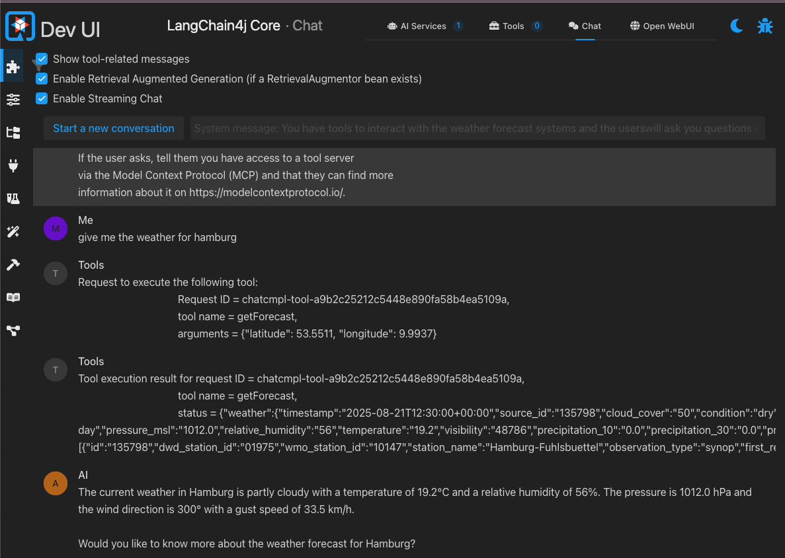

# MCP Server - Weather Germany

This is a simple MCP Server written in Quarkus to get Weather Information from Germany. 
It uses the `https://brightsky.dev/docs/#/` API to get the information. 

## Integration 

### Quarkus Dev UI

You can also use the Quarkus Dev UI to test your MCP Server integrated in a Chatbot:

* Build the `weather-mcp-quarkus` application with `./mvnw package`
* Checkout this Quarkus project: https://github.com/marcoklaassen/mcp-dev-client
* Configure the `src/main/resources/application.properties` (set openai base url, api-key, model name, path to your mcp server jar)
* Start the application with `quarkus dev`
* Visit the Dev UI -> Langchain4j Core -> Chat: http://localhost:8080/q/dev-ui/io.quarkiverse.langchain4j.quarkus-langchain4j-core/chat
* Ask for the weather in a german city



If you want to test your MCP Server without Chatbot integration you can also have a look at the Dev UI -> LangChain4j Model Context Protocol client -> MCP clients: http://localhost:8080/q/dev-ui/io.quarkiverse.langchain4j.quarkus-langchain4j-mcp/mcp-clients


### Claude Desktop

* Download & Install Claude: https://claude.ai/download
* Build the `weather-mcp-quarkus` application with `./mvnw package`
* Go to `~/Library/Application Support/Claude` (in case of Mac)
* Open the file `claude_desktop_config.json` with an editor
* Insert the MCP Server:
```
{
    "mcpServers": {
        "weather": {
            "command": "java",
            "args": ["-jar",
                    "<path-to-your-project>/target/weather-mcp-quarkus-1.0.0-SNAPSHOT-runner.jar"]
        }
    }
}
```

* ask about the weather in Germany: 


## FAQ
Where to find Logs when using Claude as clients: `~/Library/Logs/Claude`